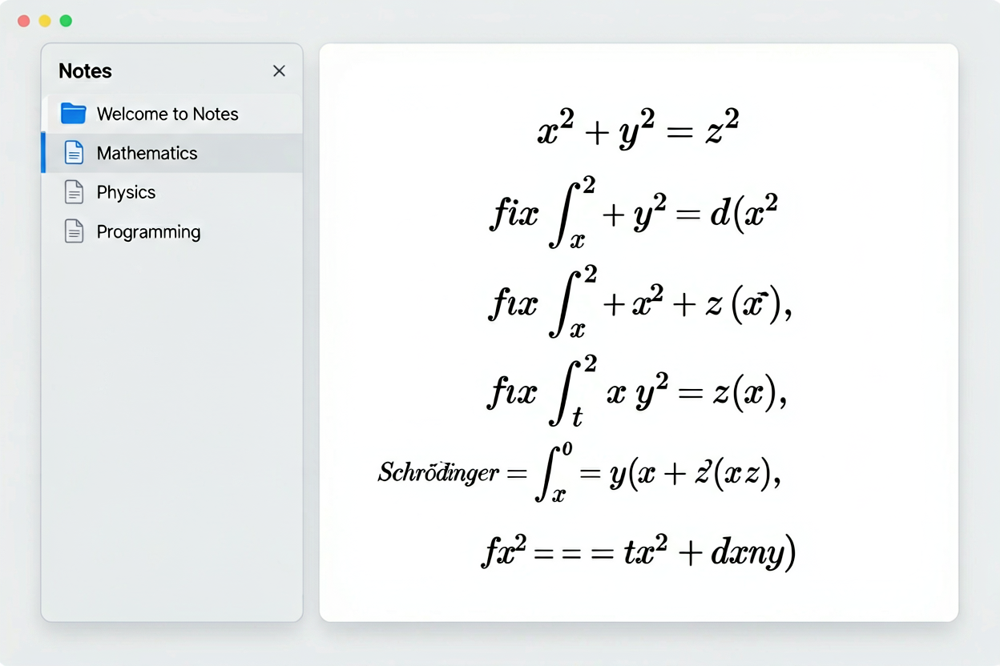

# Notes

A minimal, beautiful note-taking website where notes are written in **Typst** and pre-compiled to PDF for browser-native viewing with full text selection.



## ✨ Features

- **Write in Typst** — use Typst's expressive markup language
- **Compiled to PDF** — `typst compile` produces PDF with fully selectable text
- **Instant loading** — browser-native PDF viewer, no WASM or plugins needed
- **File management** — sidebar with note listing
- **Minimalist design** — clean, distraction-free reading with dark/light mode
- **GitHub Pages** — push to `main` and it's live

## 🚀 Quick Start

### 1. Fork / Clone

```bash
git clone https://github.com/YOUR_USERNAME/note_web.git
cd note_web
```

### 2. Add your notes

Create `.typ` files in `notes/`:

```bash
echo '= My First Note

Hello, world!' > notes/my-first-note.typ
```

### 3. Enable GitHub Pages

1. **Settings → Pages → Source: "GitHub Actions"**
2. Push to `main` — CI compiles `.typ` → SVG and deploys

Site live at `https://YOUR_USERNAME.github.io/note_web/`

## 📁 Project Structure

```
├── .github/workflows/deploy.yml   # CI: install typst → compile → deploy
├── assets/
│   ├── css/style.css              # Minimalist styling
│   ├── js/app.js                  # App logic (PDF embedding + sidebar)
│   └── compiled/                  # CI-generated PDFs (gitignored)
├── notes/
│   ├── manifest.json              # Auto-generated by CI
│   ├── welcome.typ
│   ├── mathematics.typ
│   └── ...
├── scripts/
│   └── build.js                   # Compiles .typ → PDF + writes manifest
├── index.html
├── favicon.svg
└── README.md
```

## 🧑‍💻 Local Development

```bash
# 1. Install typst & poppler-utils (for pdfinfo)
# 2. Build
node scripts/build.js

# 3. Serve
python3 -m http.server 8080 --bind 127.0.0.1
```

## ✍️ Writing Notes

Notes are plain Typst files. Supported features:

| Feature | Example |
|---|---|
| Headings | `= Section` / `== Subsection` |
| Bold/Italic | `*bold*` / `_italic_` |
| Math | `$x^2 + y^2 = z^2$` |
| Code | `` `inline code` `` / `` ``` fence ``` `` |
| Lists | `- item` / `+ numbered` |
| Links | `https://typst.app` |

See [Typst docs](https://typst.app/docs/) for full syntax.

## 🛠 How It Works

1. **At build time (CI):** `typst compile` converts each `.typ` file to PDF
2. **In the browser:** PDFs are embedded via `<embed>`, rendered natively by the browser with full text selection, search, and printing
3. A Node script generates `manifest.json` with page counts from `pdfinfo`
4. The entire site is static; no server, no runtime dependencies

## 📄 License

MIT
